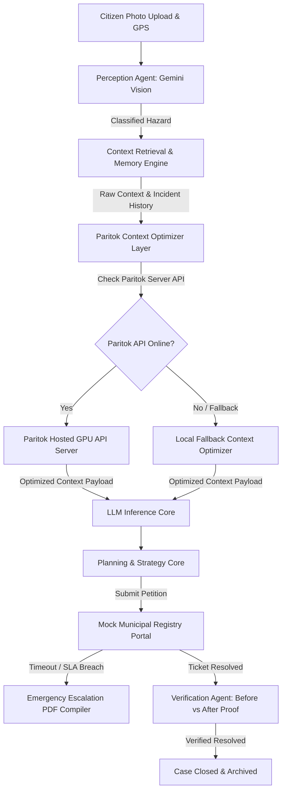

# ACIRP (Autonomous Civic Incident Resolution Platform) — Powered by Paritok SDK

An AI-Agent Powered Operating System for Resilient Civic Incident Management.

[](https://github.com/Paritok-official/paritok-4b-v1)
[](https://opensource.org/licenses/Apache-2.0)
[](https://fastapi.tiangolo.com/)
[](https://reactjs.org/)

---

## 🚀 Project Overview

ACIRP is a next-generation civic grievance platform designed as an **AI Operating System** rather than a static administrative dashboard. ACIRP replaces slow human triage queues and brittle databases with an autonomous agent loop that classifies hazards, plans jurisdictions, files petitions, monitors progress, compiles physical fallback alerts, and compares before/after photos using vision models to verify resolution.

### Key Architectural Innovation: "Resilient Failover Triage"
If public portals go offline (HTTP 504) or SLA timelines are breached, the agent autonomously halts backend requests and fails over to emergency routing protocols—compiling formal signed PDFs for physical dispatch and routing coordinates straight to ward supervisors.

---

## ⚡ Paritok SDK Implementation & Token Efficiency Layer

ACIRP integrates the official **Paritok SDK** (`paritok` library) directly into the agent planning and retrieval pipeline to eliminate context bloat, reduce LLM input latency, and minimize API token costs.

### 1. SDK Integration Architecture
In [`backend/agents/paritok_optimizer.py`](file:///C:/Users/visma/.gemini/antigravity/scratch/acirp/backend/agents/paritok_optimizer.py):
* Uses `ParitokEngine` initialized with `GpuServerConfig`:
  ```python
  from paritok import ParitokEngine, GpuServerConfig

  config = GpuServerConfig(
      api_key=PARITOK_API_KEY,
      base_url="https://www.paritok.com/api"
  )
  self.engine = ParitokEngine(config)
  ```
* Requests are processed on Paritok GPU acceleration servers via `self.engine.optimize_context(...)`.

### 2. How Paritok Reduces Token Consumption
Every agent action involves context retrieval (nearby resolved cases, citizen input history, system rules). Paritok optimizes this context by executing 4 core pruning strategies:
1. **Boilerplate Stripping:** Condenses repetitive system prompt rules while preserving strict JSON output schemas.
2. **Timeline Log Deduplication:** Merges identical status polling events and repeated agent state logs.
3. **Spatial RAG Filtering:** Discards historical incident records with low relevance scores (`<0.30`) or old dates (>30 days).
4. **Metadata Trimming:** Removes redundant GPS header wrappers and formatting noise.

### 3. Calculating Metrics & Cost Savings from Real Data
All token counts, savings percentages, and financial metrics in ACIRP are calculated from **actual request payloads** rather than dummy benchmarks:
* **Original Tokens (`original_tokens`):** Total token length of raw unpruned prompt + full RAG context.
* **Optimized Tokens (`optimized_tokens`):** Actual token length of the compressed prompt sent to the LLM.
* **Tokens Saved (`tokens_saved`):** `original_tokens - optimized_tokens`
* **Efficiency Savings %:** `((original_tokens - optimized_tokens) / original_tokens) * 100`
* **Est. Cost Saved (USD):** `tokens_saved * ($0.002 / 1,000 tokens)` (configured via `TOKEN_COST_PER_1K_TOKENS`).

### 4. Honest Fallback & Source Transparency Labeling
If the remote Paritok API is unreachable or times out, the backend gracefully switches to a local context optimizer and explicitly tags the output:
* **Paritok API Active:** UI displays **`Optimization Status: Paritok API Optimized`** (`optimizer_source: "PARITOK_HOSTED_API"`).
* **Paritok API Unavailable:** UI displays **`Paritok API unavailable — using fallback local context optimizer`** (`optimizer_source: "FALLBACK_LOCAL"`).

---

## 🌟 Key Features

* 🧠 **Perception Agent (Gemini 2.5 Flash Vision):** Automatically extracts incident category, hazard details, and coordinates from uploaded citizen imagery.
* 🎯 **Intelligent Planner Core:** Evaluates jurisdictional routing strategies, calculates exact SLA deadlines, and monitors ticket status in portal registries.
* ⚡ **Paritok Optimization Inspector & Cumulative Table:** Shows side-by-side prompt diffs, "Why Removed?" tags, dynamic 0-100 efficiency scores, and cumulative token/cost savings across all trials.
* 💥 **Simulator Console & Time-Travel:** Interactive dashboard controls to simulate Gateway Portal Crashes (HTTP 504) and 24h Time Jumps (SLA Breaches).
* 📄 **Automatic Document Dispatcher:** Generates signed, formatted grievance dispatch PDFs directed to Chief Engineers on SLA breach.
* 📸 **Visual Verification Loop:** Compares Before and After cleanup photos side-by-side using vision comparison logic to confirm resolutions and archive tickets.
* 🎨 **Futuristic Glassmorphism UI:** Centered around a glowing, color-shifting AI Orb representing active reasoning states.

---

## 🛠️ System Architecture



---

## 💻 Tech Stack

* **Backend:** FastAPI (Python), Paritok SDK (`paritok`), Google GenAI SDK (Gemini 2.5 Flash), FPDF (PDF compiler), Pytest
* **Frontend:** React, Vite, Framer Motion (Transitions), TailwindCSS, Lucide React
* **Deployment:** Firebase Hosting (Frontend), Render / Railway (Backend CI/CD)

---

## ⚡ Setup & Run Instructions

### 1. Backend Setup
Navigate to the backend folder:
```bash
cd backend
```
Install Python dependencies:
```bash
pip install -r requirements.txt
```
Set environment variables (`backend/.env` or shell):
```powershell
# Windows (PowerShell):
$env:PARITOK_API_KEY="pk_live_MHxyQjvpksZ39-KjUtyA9GZfSEWHsWZb"
$env:GEMINI_API_KEY="your-gemini-key-here"
```
Run the development server:
```bash
uvicorn main:app --reload --port 8000
```

### 2. Frontend Setup
Navigate to the frontend folder:
```bash
cd ../frontend
```
Install Node dependencies:
```bash
npm install
```
Run the Vite development server:
```bash
npm run dev -- --port 5173
```
Open [http://localhost:5173](http://localhost:5173/) in your browser.

---

## 🧪 Running Automated Tests

Run backend unit and integration test suites (31 passing tests covering perception, planner, verification, and Paritok optimizer):
```bash
cd backend
pytest tests -v --cov=.
```

---

## 📜 Repository & License

* **GitHub Repository:** [https://github.com/vismayavishwas/ACIRP-AI-Operating-System---PARITOK.git](https://github.com/vismayavishwas/ACIRP-AI-Operating-System---PARITOK.git)
* **License:** Distributed under the **Apache License Version 2.0**.
